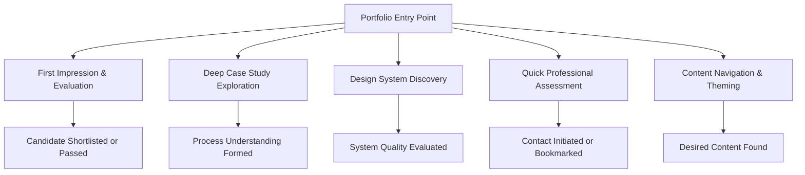
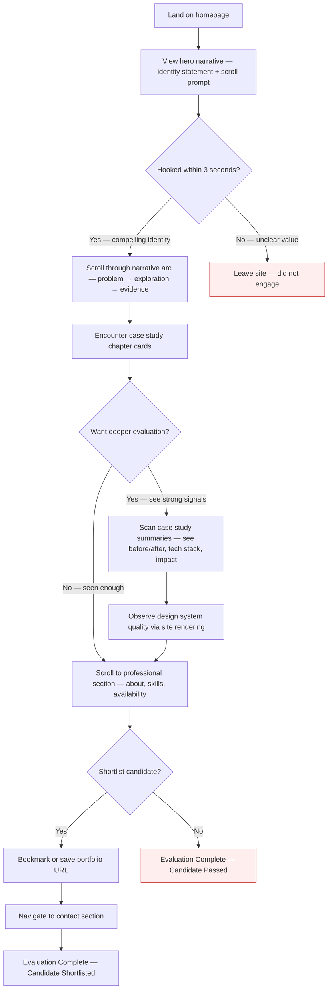
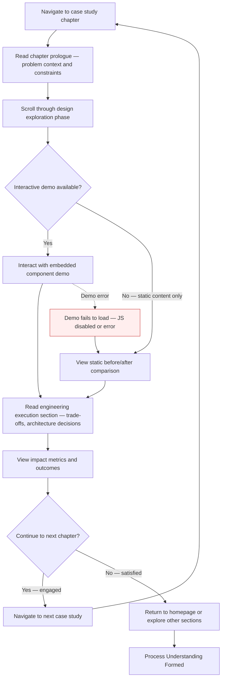
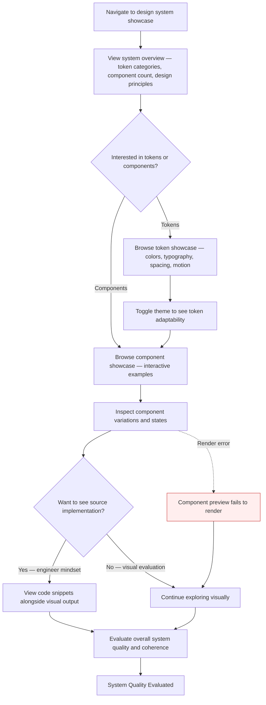
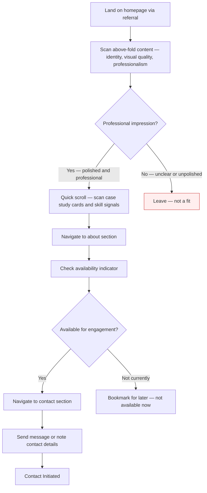
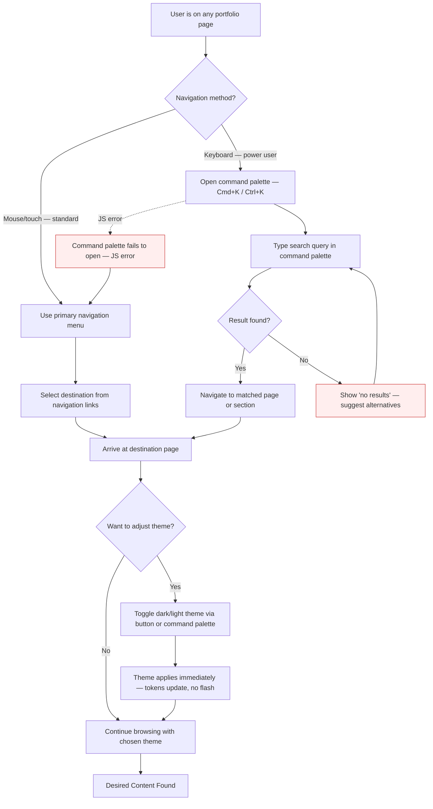

# User Flows

<!-- Mermaid conventions: flowchart TD, node IDs with journey prefix (J1_1, J1_2),
     labels in double quotes, error styles: style NODE fill:#fee,stroke:#c33,
     NEVER use bare 'end' as node ID -->

---

## Overview: All User Journeys

---

## Journey 1: First Impression & Evaluation

**User:** Evaluating Hiring Manager
**Goal:** Quickly assess whether this candidate demonstrates the intersection of design craft and engineering capability, then decide whether to shortlist
**Entry point:** Homepage via application link, LinkedIn, or direct URL

### Step Descriptions

1. **J1_1 - Homepage Landing:** Hiring manager arrives at the portfolio root. Page loads with sub-1s LCP via Server Components. Dark mode default with immediate visual impact.
2. **J1_2 - Hero Narrative:** The above-fold content presents a clear identity statement ("Design Engineer") with a subtle scroll prompt. Motion design begins to reveal the narrative arc. This is the 3-second hook.
3. **J1_3 - First Impression Decision:** The critical decision point — within 3 seconds the hiring manager forms an impression. A compelling identity statement and polished visual execution encourage continued scrolling. Unclear positioning or generic presentation causes bounce.
4. **J1_4 - Narrative Scroll:** The hiring manager scrolls through the story arc. Content reveals in reading order: problem awareness → design exploration → engineering execution. Scroll-driven animations enhance but respect prefers-reduced-motion.
5. **J1_5 - Case Study Cards:** The narrative surface case study chapter cards — each showing a project title, brief description, visual preview, and key metrics (tech stack, impact, role).
6. **J1_6 - Depth Decision:** The hiring manager decides whether the surface signals are strong enough to warrant deeper exploration. Strong visual design + clear engineering signals encourage deeper engagement.
7. **J1_7 - Case Study Scanning:** Summaries provide before/after comparisons, technology stack badges, and quantified impact statements. Each card links to a full case study chapter.
8. **J1_8 - Implicit System Evaluation:** The site's own rendering quality — consistent spacing, type hierarchy, responsive behavior, animation smoothness — serves as implicit proof of design system craft.
9. **J1_9 - Professional Section:** About/bio with professional timeline, skills matrix, and availability indicator. This section answers "who is this person and are they available?"
10. **J1_10 - Shortlist Decision:** Final evaluation — does this candidate warrant an interview? Strong signals: unique visual identity, clear engineering depth, professional presentation, accessible and performant site.
11. **J1_11 - Bookmark/Save:** Positive decision — the hiring manager saves the URL for team sharing or later reference.
12. **J1_12 - Contact Navigation:** The hiring manager navigates to the contact section to initiate outreach or note contact information.
13. **J1_DONE - Shortlisted:** The candidate is added to the shortlist. Journey succeeds.
14. **J1_EXIT - Early Bounce (ERROR):** The hiring manager leaves within 3 seconds — the hero narrative failed to communicate value. Mitigation: strong above-fold identity statement, fast load time, immediate visual polish.
15. **J1_PASS - Passed (ERROR):** The hiring manager evaluated the portfolio but decided not to shortlist. This is a valid outcome — not all evaluations result in shortlisting. The portfolio should minimize this by maximizing signal quality at every step.

---

## Journey 2: Deep Case Study Exploration

**User:** Evaluating Hiring Manager / Peer Design Engineer
**Goal:** Understand the decision-making process behind a specific project — not just the outcome, but the journey from problem to solution
**Entry point:** Case study card from homepage, direct link shared on social media, or navigation menu

### Step Descriptions

1. **J2_1 - Chapter Entry:** User navigates to a specific case study. The chapter loads as a Server Component with immediate content paint. URL is shareable and SEO-optimized with dynamic OG image.
2. **J2_2 - Problem Context:** The chapter opens with the problem statement, project constraints, team structure, and the candidate's specific role. This frames what follows as a design engineering narrative, not just a visual showcase.
3. **J2_3 - Design Exploration:** The user scrolls through the design phase — early explorations, rejected approaches, design system decisions, component iterations. This is the "show your work" section that traditional portfolios omit.
4. **J2_4 - Demo Availability Check:** The chapter may include interactive demos (Client Components). If JavaScript is available and the component loaded successfully, the interactive version is shown. Otherwise, a static fallback is presented (progressive enhancement).
5. **J2_5 - Interactive Demo:** The user interacts with an embedded component demo — toggling states, resizing viewports, switching themes. This is the design system proof-of-work in action.
6. **J2_6 - Static Fallback:** If no demo is available or JS is disabled, a static before/after comparison or annotated screenshot sequence serves the same narrative purpose.
7. **J2_ERR1 - Demo Load Failure (ERROR):** The interactive demo fails to load due to JavaScript being disabled, a network error, or a component error. The fallback is the static version — content is never blocked by a failed demo. Progressive enhancement ensures core narrative is always accessible.
8. **J2_7 - Engineering Execution:** Technical decisions, architecture trade-offs, performance optimizations, and accessibility considerations. Code snippets with syntax highlighting demonstrate engineering depth.
9. **J2_8 - Impact & Outcomes:** Quantified results, before/after metrics, and reflections on what worked and what the candidate would do differently. This section proves outcomes, not just process.
10. **J2_9 - Continuation Decision:** After completing a chapter, the user decides whether to explore another case study or return to the portfolio. Strong engagement leads to sequential chapter reading.
11. **J2_10 - Next Chapter:** The user navigates to the next case study, repeating the journey from step 1.
12. **J2_11 - Exit Chapter:** The user returns to the homepage or explores other portfolio sections.
13. **J2_DONE - Understanding Formed:** The user has developed a clear picture of the candidate's design engineering process, decision-making quality, and technical depth.

---

## Journey 3: Design System Discovery

**User:** Peer Design Engineer
**Goal:** Explore the SignalframeUX design system — evaluate component quality, token architecture, and pattern design
**Entry point:** Design system showcase page via navigation menu or footer link

### Step Descriptions

1. **J3_1 - Showcase Entry:** Peer engineer navigates to the design system showcase page. This is a dedicated page (not a case study) that presents SignalframeUX as a system.
2. **J3_2 - System Overview:** High-level view of the design system: token categories (colors, typography, spacing, motion, shadows, borders), component inventory, and design principles. This establishes system scope.
3. **J3_3 - Exploration Path Decision:** The peer engineer chooses whether to explore the foundational tokens (bottom-up) or the composed components (top-down). Both paths are valid entry points.
4. **J3_4 - Token Showcase:** Interactive display of the design token system — color scales with oklch values, type scale with ratio (Augmented Fourth 1.414), spacing scale, motion tokens. Each token category shows the value, its CSS custom property name, and usage context.
5. **J3_5 - Component Showcase:** Interactive component examples showing default state, hover, focus, active, disabled, and error states. Components render using the actual SignalframeUX tokens.
6. **J3_6 - Theme Toggle:** The peer engineer toggles between dark and light themes to evaluate how tokens adapt. This demonstrates the token architecture's theme capability.
7. **J3_7 - Component Variations:** Deeper exploration of component variants — sizes, color schemes, composition patterns. This evaluates the system's flexibility and consistency.
8. **J3_8 - Implementation Curiosity:** The engineer-minded visitor wants to see how components are built — React patterns, TypeScript types, CSS approach.
9. **J3_9 - Code View:** Code snippets appear alongside the visual component — showing the component API, props interface, and implementation highlights. Syntax highlighting via the design system's code tokens.
10. **J3_10 - Visual Evaluation:** The visitor continues exploring components visually without inspecting code. The visual quality alone communicates design system maturity.
11. **J3_ERR1 - Render Failure (ERROR):** A component preview fails to render due to a Client Component error. Fallback: show a static screenshot of the component with a note that the interactive preview is unavailable. Error boundary prevents cascade.
12. **J3_11 - Quality Assessment:** The peer engineer forms an overall assessment of the design system — coherence, completeness, craft quality, and production readiness.
13. **J3_DONE - Evaluation Complete:** The visitor has evaluated SignalframeUX and formed an opinion on the candidate's design system capability.

---

## Journey 4: Quick Professional Assessment

**User:** Potential Collaborator
**Goal:** Quickly assess craft quality and professional availability for a potential engagement
**Entry point:** Direct link from referral, social media, or search

### Step Descriptions

1. **J4_1 - Referral Landing:** Collaborator arrives via a shared link — the URL likely points to the homepage. Fast load and immediate visual impact are critical for referral traffic.
2. **J4_2 - Above-Fold Scan:** The collaborator spends 5-10 seconds assessing the above-fold content. They're evaluating: Is this person professional? Is the work high quality? Does the visual identity communicate expertise?
3. **J4_3 - Professional Impression Decision:** Quick judgment based on visual quality, typography, and content clarity. A polished, distinctive site signals professionalism. A generic or template-looking site fails this check.
4. **J4_4 - Quick Scroll:** The collaborator scrolls quickly through the page — not reading deeply but scanning for quality signals. Case study cards, skill badges, and visual consistency build confidence.
5. **J4_5 - About Section:** Navigate to the about page for professional context — role, experience timeline, domain expertise, and personal positioning.
6. **J4_6 - Availability Check:** The availability indicator (a subtle UI element) communicates current status: available for work, booked, or selectively available. This saves both parties time.
7. **J4_7 - Availability Decision:** If available, the collaborator proceeds to contact. If not currently available, they bookmark for future reference.
8. **J4_8 - Contact Section:** The contact section provides clear, accessible contact methods — not a complex form, but direct communication channels.
9. **J4_9 - Outreach:** The collaborator sends a message or saves contact information for later outreach.
10. **J4_DONE - Contact Initiated:** Successful engagement begins.
11. **J4_BOOKMARK - Bookmarked:** Not available now but professional quality warrants future follow-up.
12. **J4_EXIT - Not a Fit (ERROR):** The collaborator leaves early because the site didn't communicate professional quality. Mitigation: strong above-fold design, immediate visual distinctiveness, clear identity statement.

---

## Journey 5: Content Navigation & Theming

**User:** All personas
**Goal:** Navigate efficiently between portfolio sections and personalize the viewing experience
**Entry point:** Any page within the portfolio

### Step Descriptions

1. **J5_1 - Current Page:** User is on any page within the portfolio. Navigation and theming are available globally.
2. **J5_2 - Navigation Method Decision:** Users choose between keyboard-first navigation (command palette) and standard navigation (menu links). The command palette is an enhanced experience for power users; standard navigation works for everyone.
3. **J5_3 - Command Palette Open:** User presses Cmd+K (macOS) or Ctrl+K (Windows/Linux) to open the command palette (cmdk). This is a Client Component that requires JavaScript.
4. **J5_4 - Standard Navigation:** User clicks/taps the navigation menu. Server-rendered links work without JavaScript (progressive enhancement).
5. **J5_5 - Search Query:** User types a query in the command palette — page names, case study titles, keywords. Fuzzy matching helps find content.
6. **J5_6 - Link Selection:** User selects a destination from the navigation menu. Links are clearly labeled and organized.
7. **J5_7 - Search Result Check:** The command palette either finds matching results or shows a "no results" state with suggestions.
8. **J5_8 - Navigate to Match:** User selects a search result and navigates to the matched page or section.
9. **J5_9 - No Results (ERROR):** The search query doesn't match any content. The palette suggests alternative queries or popular destinations. The user can refine their search.
10. **J5_10 - Destination Arrived:** User reaches the desired page. Content loads via Server Components.
11. **J5_11 - Theme Preference:** User may want to switch themes — from dark (default) to light, or system preference.
12. **J5_12 - Theme Toggle:** User toggles the theme via a button in the navigation or via the command palette ("toggle theme" command). Theme preference is persisted in localStorage.
13. **J5_13 - Immediate Theme Application:** CSS custom properties update instantly — no page reload, no flash of unstyled content. The design system's token architecture enables seamless theme switching.
14. **J5_14 - Continue Browsing:** User continues with their chosen theme. Preference persists across sessions.
15. **J5_DONE - Content Found:** User has successfully navigated to their desired content with their preferred theme.
16. **J5_ERR1 - Command Palette Failure (ERROR):** JavaScript error prevents the command palette from opening. Fallback: standard navigation menu is always available (server-rendered). The command palette is an enhancement, not a requirement.

---

## Flow Summary

| Journey | Steps | Decision Points | Error States | Complexity |
|---------|-------|-----------------|--------------|------------|
| First Impression & Evaluation | 12 | 3 | 2 | high |
| Deep Case Study Exploration | 11 | 3 | 1 | medium |
| Design System Discovery | 11 | 2 | 1 | medium |
| Quick Professional Assessment | 9 | 3 | 1 | low |
| Content Navigation & Theming | 14 | 4 | 2 | medium |

---

*Generated by PDE-OS /pde:flows | 2026-03-31*
*Source: .planning/design/strategy/BRF-brief-v1.md*
